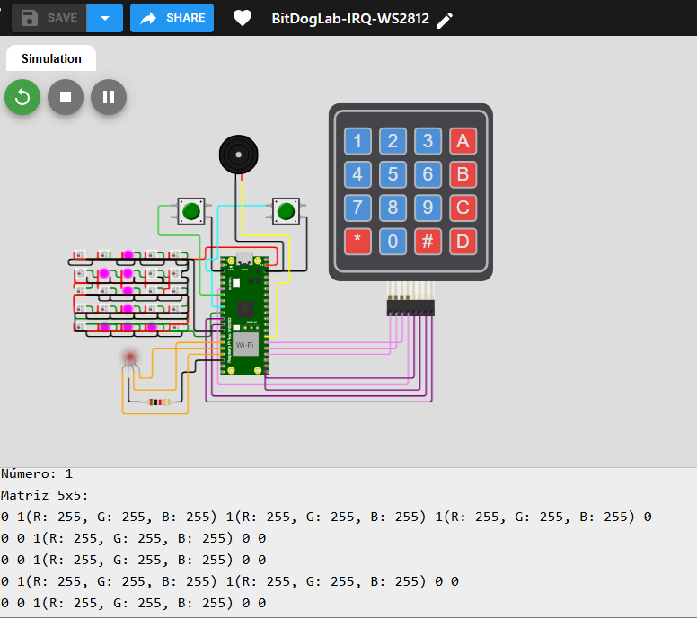
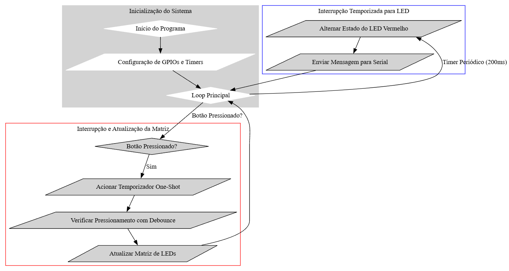

# BitDogLab-IRQ-WS2812

## Controle de LEDs e Interrupções no RP2040 com PIO e WS2812b

O código combina temporizadores, interrupções externas e comunicação eficiente com LEDs WS2812b, tornando-o uma excelente base para projetos de IoT, automação e sistemas embarcados avançados.

## **Por que esse projeto escolhido é de extrema importancia?**

- Aprendizado sobre PIO no RP2040 → A PIO é um recurso poderoso do RP2040 que permite comunicação precisa com dispositivos como os LEDs WS2812, sem sobrecarregar a CPU.
- Interrupções e eficiência energética → A abordagem baseada em IRQ (Interrupções) minimiza o consumo de CPU ao evitar polling constante.
- Aplicação real → O controle de uma matriz 5x5 de LEDs e a interface com botões físicos são cenários comuns em painéis interativos, jogos eletrônicos e sistemas embarcados industriais.
- Uso otimizado de hardware → Foi escolhido um controle eficiente dos LEDs WS2812 sem bibliotecas externas pesadas, permitindo tempo de resposta preciso.

## Funcionalidades Implementadas

- Interrupções externas (IRQ) para resposta instantânea aos botões
- Botão A: Incrementa o número exibido na matriz de LEDs
- Botão B: Decrementa o número exibido na matriz de LEDs
- Exibição de números de 0 a 9 na matriz WS2812 com efeitos visuais
- Debouncing via software para evitar leituras incorretas dos botões
- LED vermelho piscando 5 vezes por segundo via interrupção de temporizador

### Tecnologias e Conceitos Utilizados

- Interrupções externas (IRQ) para resposta rápida aos botões.
- Debouncing via software para evitar leituras incorretas.
- Controle de LEDs comuns e endereçáveis.
- Uso eficiente dos resistores de pull-up internos.

### Simulador para a prototipação do projeto

[Link para o Simulador WOKWI para este projeto](https://wokwi.com/projects/421723658398901249 "Simulador WOKWI para este projeto")

[](https://github.com/hsantosdias/BitDogLab-IRQ-WS2812/blob/main/imgs/simulador.png?raw=true "Simulador do Projeto")

### Fluxograma do projeto

#### Explicação do Fluxograma
1. Bloco de Inicialização (cluster_Init)
- Start → O programa inicia sua execução.
- Init → GPIOs, timers e a matriz WS2812 são configurados.
- Loop → O loop principal é iniciado para manter o sistema rodando.
1. Temporizador Periódico (cluster_TimerPeriodico)
- Loop → No loop principal, o temporizador periódico verifica o tempo a cada 200ms.
- Semaforo → O LED vermelho alterna entre ligado/desligado 5 vezes por segundo.
- SerialMsg → Mensagens de status podem ser enviadas para a saída serial.
- Loop → O fluxo retorna ao loop principal.
2. Temporizador One-Shot para Botões (cluster_TimerOneShot)
- Loop → O programa verifica eventos no GPIO.
- BotaoPress → Se o botão for pressionado, uma interrupção é gerada.
- OneShot → Um timer one-shot é acionado para debounce.
- Debounce → Confirma se o botão realmente foi pressionado (evita falsos acionamentos).
- EndSeq → Atualiza a exibição da matriz WS2812.
- Loop → O fluxo retorna ao loop principal.


[](https://github.com/hsantosdias/BitDogLab-IRQ-WS2812/blob/main/imgs/fluxograma.png?raw=true "Fluxograma do projeto")

## Bibliotecas Utilizadas e Justificativas

A escolha das bibliotecas foi baseada em eficiência e controle preciso do hardware:

| Biblioteca        | Motivação                                                                                                     |
| ----------------- | --------------------------------------------------------------------------------------------------------------- |
| pico/stdlib.h     | Permite funções básicas de entrada/saída e delays no RP2040.                                                |
| hardware/gpio.h   | Controle direto dos pinos GPIO, essencial para os botões e LEDs.                                               |
| hardware/clocks.h | Utilizado para ajustar e monitorar a frequência do sistema, garantindo precisão nos tempos.                   |
| hardware/irq.h    | Habilita e configura interrupções no RP2040, permitindo resposta rápida a eventos externos.                  |
| hardware/timer.h  | Necessário para criar um temporizador que faz o LED vermelho piscar 5 vezes por segundo.                       |
| hardware/sync.h   | **Garante operações atômicas e protege contra concorrência em variáveis globais em interrupções**. |
| ws2818b.pio.h     | Programa**PIO personalizado** para controlar a matriz WS2812 com eficiência.                             |

## Destaque: #include "hardware/sync.h"

- O RP2040 é um microcontrolador dual-core, e interrupções podem ocorrer a qualquer momento, modificando variáveis globais.
- A biblioteca hardware/sync.h fornece mecanismos para evitar condições de corrida, garantindo que interrupções não corrompam dados compartilhados.

### Como foi usada?

- save_and_disable_interrupts() → Desativa interrupções temporariamente ao atualizar os LEDs WS2812, evitando falhas na transmissão.
- restore_interrupts() → Reativa as interrupções após a atualização dos LEDs.

### Por que é necessário?

Sem essa biblioteca, a CPU pode ser interrompida no meio de uma operação crítica, causando LEDs piscando de forma errática ou falhas na matriz WS2812.

### Organização do Código

O código está estruturado e comentado para facilitar a compreensão e reutilização.

##### Principais Arquivos

- BitDogLab-IRQ-WS2812.c → Código principal com controle de LEDs e botões via interrupções.
- ws2818b.pio.h → Código PIO customizado para comunicação eficiente com os LEDs WS2812.

##### Estrutura do Código

- npInit() → Inicializa a comunicação com os LEDs WS2812 via PIO.
- npWrite() → Atualiza a matriz de LEDs, garantindo sincronização correta.
- gpio_callback() → Trata eventos de botão e altera a exibição da matriz.
- blink_led_callback() → Mantém o LED vermelho piscando 5 vezes por segundo.

### Demonstração

Além do código-fonte, disponibilizo um vídeo demonstrando o funcionamento do projeto na placa BitDogLab.


[Video demonstrado o projeto em funcionamento](https://drive.google.com/file/d/1TTDvBE8vrRn3kkZL7hDkG23QfaxWnmqs/view?usp=sharing "Video de apresentaçãp do projeto")


### Requisitos para Execução

- Placa de desenvolvimento: BitDogLab (RP2040)
- Matriz de LEDs WS2812 (5x5) → GPIO 7
- LED RGB → GPIOs 11, 12, 13
- Botões de controle → GPIOs 5 e 6

## **Configuração do Ambiente**

1. **Instale o SDK do Raspberry Pi Pico:**

- Siga o guia oficial de instalação do [Pico SDK](https://www.raspberrypi.com/documentation/microcontrollers/c_sdk.html).

2. **Clone o repositório:**
   ```bash
   git clone https://github.com/hsantosdias/BitDogLab-IRQ-WS2812.git
     cd BitDogLab-IRQ-WS2812
   ```

## **Como Usar**

1. Compile o código utilizando o SDK do RP2040.
2. Faça o upload para a placa BitDogLab.
3. Pressione os botões para testar o incremento/decremento da matriz WS2812!
